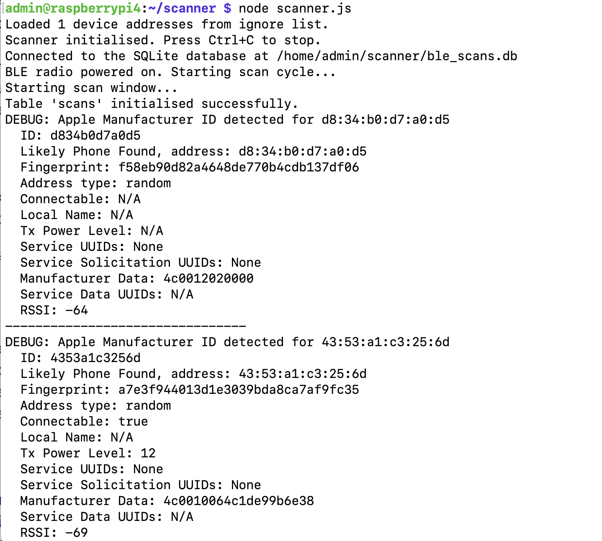
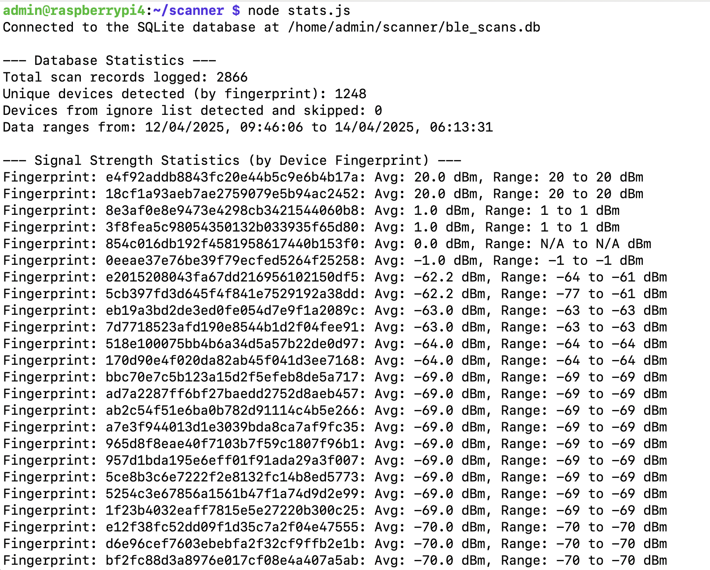
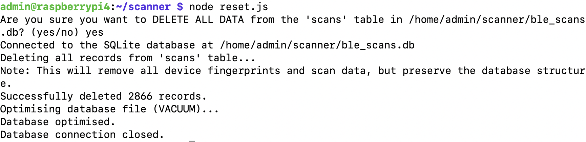

# BLE Scanner

A Bluetooth Low Energy (BLE) scanning application designed to detect and log mobile phones in the vicinity. This tool is particularly useful for traffic analysis at events, conventions, or public spaces. The tool is designed to run on a Raspberry Pi, and was tested on a Pi4.

Possible use cases:
- People counting / footfall monitoring (anonymously)
- Proximity-based experiences (e.g. in a museum)
- Asset tracking with BLE beacons (Eddystone, iBeacon)

This app is associated with the parallel BLE scanner Dashboard, see https://github.com/rendzina/ble_scanner_dashboard



## Overview

This application scans for BLE devices in regular windows (10 seconds every minute), with a focus on identifying mobile phones based on manufacturer data, service UUIDs, and device names. It uses device fingerprinting to reliably track unique devices even when they use random or changing MAC addresses for privacy. All detected devices are logged to both the console and a local SQLite database for later analysis.

## Features

- **Window-Based Scanning**: Scans for 10 seconds every minute to balance power usage and detection
- **Device Fingerprinting**: Reliably track devices using stable characteristics:
  - Manufacturer data
  - Service UUIDs
  - Device names
  - Address types
  - Connectable status
- **Device Memory**: Tracks devices for 5 minutes to avoid duplicate processing
- **Phone Detection**: Identify likely phones using multiple heuristics:
  - Apple manufacturer ID detection
  - Apple Notification Centre Service (ANCS) UUID detection
  - Device name pattern matching (iPhone, Pixel)
- **Persistent Storage**: Log device information to a SQLite database
- **Statistics Reporting**: Generate detailed reports on detected devices
- **Database Management**: Tools for resetting and managing the database

## Requirements

- Node.js (v14 or higher recommended)
- Bluetooth adapter with BLE support
- SQLLite logging database
- Linux-based system (tested on Raspberry Pi 4)



## Installation

1. Ensure the Pi is fully up to date
   ```
   sudo apt update && sudo apt upgrade -y
   ```

2. Install Bluetooth tools and dependencies
   ```
   sudo apt install bluetooth bluez libbluetooth-dev libudev-dev -y
   ```

3. If you don't already have Node.js installed:
   ```
   curl -fsSL https://deb.nodesource.com/setup_lts.x | sudo -E bash -
   sudo apt install -y nodejs
   ```
   and check it all installed OK
   ```
   node -v
   npm -v
   ```

4. Ensure your Bluetooth adapter is enabled and has the necessary permissions:
   ```
   sudo setcap cap_net_raw+eip $(eval readlink -f $(which node))
   ```

5. Clone this repository (assumes git is installed):
   ```
   mkdir ble_scanner
   cd ble_scanner
   git clone https://github.com/rendzina/ble_scanner.git
   ```

6. Install dependencies:
   ```
   npm install @abandonware/noble
   npm install sqlite3
   ```

## Usage

### Running the Scanner

Start the BLE scanner:

```
node scanner.js
```

The scanner will:
- Load the ignore list (if present)
- Initialise the database (assumed to be held locally in the project folder)
- Begin scanning in 10-second windows every minute
- Log likely phones to the console and database
- Track devices using fingerprints to handle random MAC addresses. Devices remain anonymous, this strategy is followed to avoid relogging the same device continuously.

#### Ignore List Configuration

Create a file named `ignore_list.json` in the project directory with an array of MAC addresses to ignore. The addresses should be in lowercase and can be in any of these formats:

```json
[
  "00:11:22:33:44:55",
  "aa-bb-cc-dd-ee-ff",
  "001122334455"
]
```

**Note**: The ignore list will only work for devices with public (non-random) MAC addresses. For devices using random addresses (most), the fingerprint-based tracking system is used instead.

Press `Ctrl+C` to stop the scanner gracefully.

### Viewing Statistics

Generate a report of detected devices and behaviours:

```
node stats.js
```

This will display:
- Total scan count and unique device statistics (by fingerprint)
- Time range of collected data
- Signal strength statistics per device fingerprint
- Busiest hours analysis
- Device history tracking using fingerprints
- Manufacturer data analysis
- Service UUID analysis
- Device consistency tracking across scan windows
- Transmission power level analysis
- Most common device names

### Managing the Database

Reset the database (removes all data but preserves structure):

```
node reset.js
```

This will:
- Prompt for confirmation before deletion
- Remove all scan records and device fingerprints
- Optimise the database file
- Preserve the database schema for future scans



## Configuration

The scanner app can be configured by modifying the following constants in `scanner.js`:

- `SCAN_WINDOW_DURATION`: Duration of each scan window (default: 10000ms) - 10 seconds
- `SCAN_INTERVAL`: Time between scan windows (default: 60000ms) - 60 seconds
- `DEVICE_MEMORY_DURATION`: How long to remember devices (default: 300000ms) - 5 minutes

## Notes

- The scanner uses device md5 hash fingerprinting to handle random MAC addresses.
- Do not necessarily assume fingerprints always distinguish unique devices - the hash comprises a combination of many fields read from the device, some of which may well often be blank. The fingerprints approach is used gtogether with the scan window to try and avoid 'overlogging' the same device successively.
- Each scan window lasts 10 seconds to balance power usage and detection.
- Devices are remembered for a period (default 5 minutes) to try and avoid duplicate processing.
- The database schema is preserved during resets.
- All timestamps are in UK format (DD/MM/YYYY).

## License

This project is licensed under the MIT License - see the LICENSE file for details.

## Acknowledgements

- [@abandonware/noble](https://github.com/abandonware/noble) - BLE communication library
- [sqlite3](https://github.com/mapbox/node-sqlite3) - SQLite database driver for Node.js 
